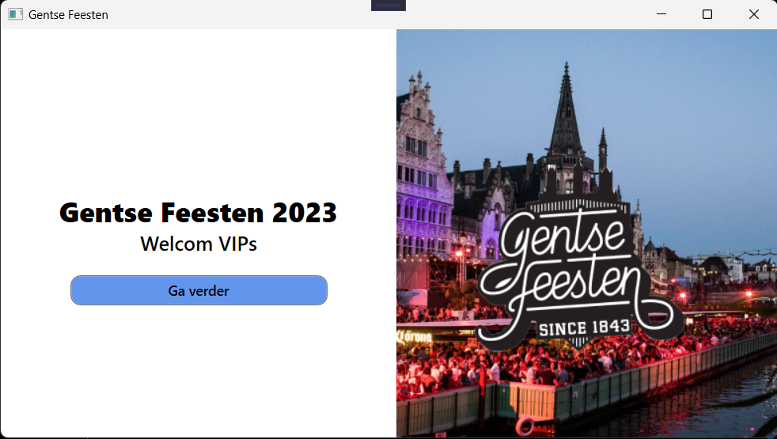
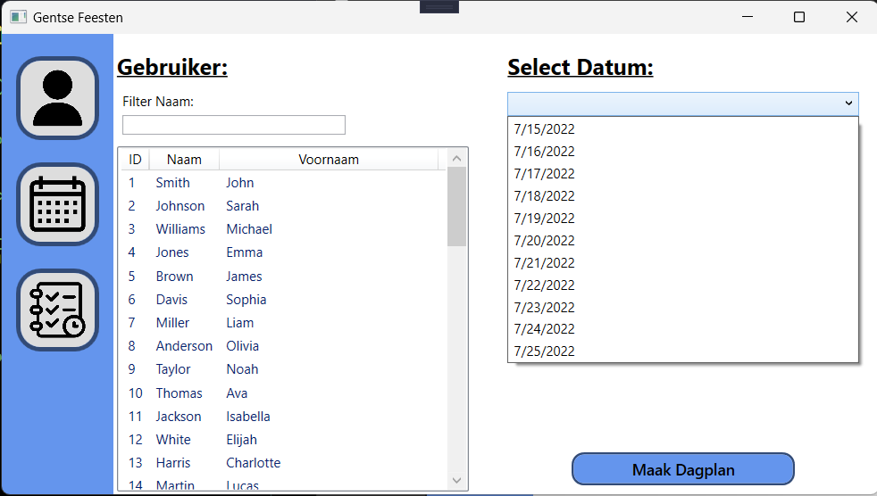
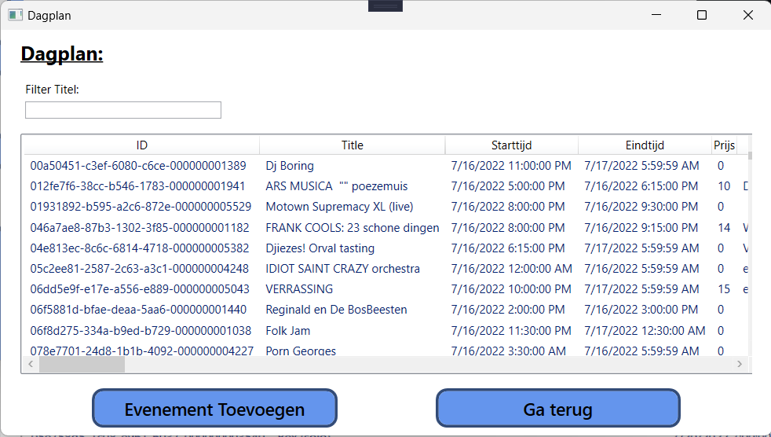
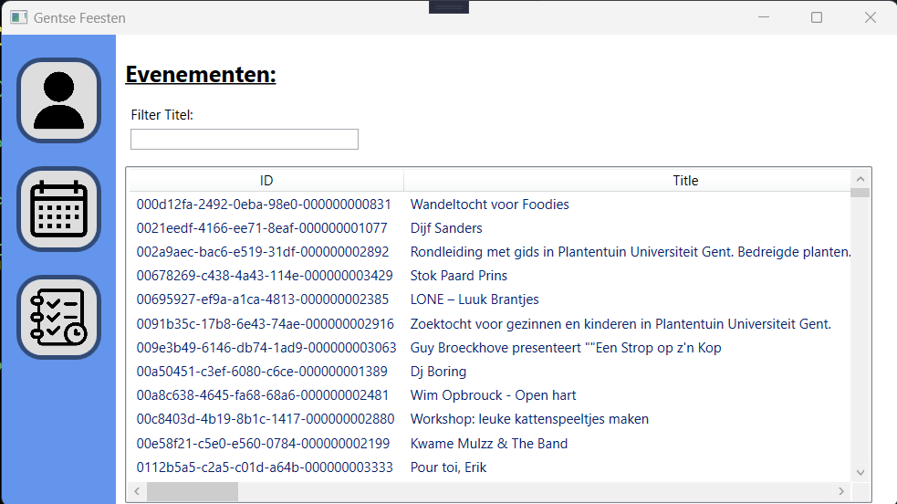
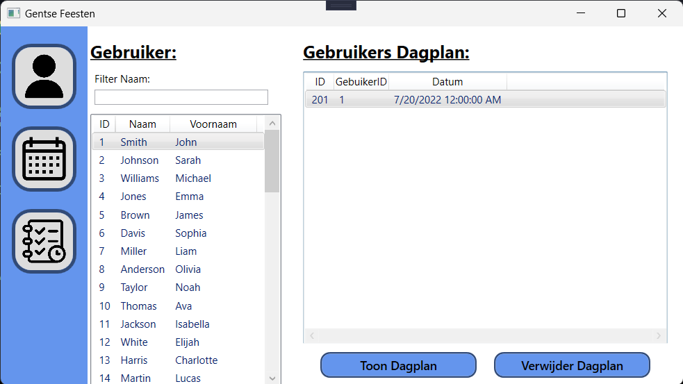

# EindOpdracht Programmeren Gevorderd (HoGent Gratduaat Programmeren 1st jaar)
> Deze opdracht is gemaakt in C# (.Net 6) en maakt gebruik van het 3 lagen model, WPF en als DataBase SQLServer.

Dit is een applicatie gemaakt voor de VIP's van de Gentse Feesten

## Welcom scherm

## Start scherm

## Gebruiker scherm
### Een lijst van de gebruiker(VIP's) en een combobox van datum zodat de gebruiker per datum een dagplan kan maken.

## Dagplan scherm
### hier kan de gebruiker evenementen toevegen aan een dagplan en het dagplan opslaan naar de DB. 

## Evenement scherm
### Een lijst van alle evenementen op de Genste Feetsen.

## Gebruikers Dagplan scherm
### Hier kan de gebruiker al zijn dagplannen zien die hij/zij heeft gemaakt en hij/zij kan de dagplannen verwijderen of downloaden naar een externe folder op de Desktop van de Gebruiker.

> Dit is gemaakt door Jelle Vandriessche