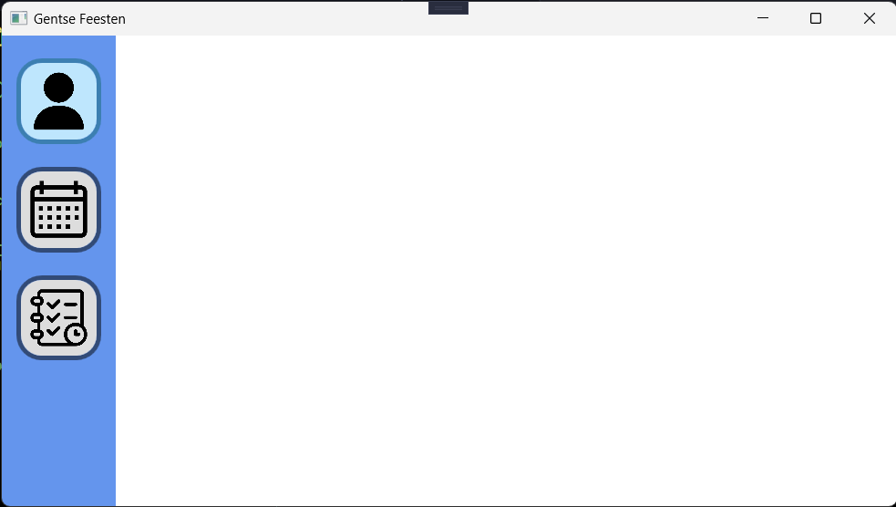

# EindOpdracht Programmeren Gevorderd (HoGent Gratduaat Programmeren 1st jaar)
> Deze opdracht is gemaakt in C# (.Net 6) en maakt gebruik van het 3 lagen model, WPF en als DataBase SQLServer.

Dit is een applicatie gemaakt voor de VIP's van de Gentse Feesten

## Welcom scherm

## Start scherm

## Gebruiker scherm
### Een lijst van de gebruiker(VIP's) en een combobox van datum zodat de gebruiker per datum een dagplan kan maken.

## Dagplan scherm
### hier kan de gebruiker evenementen toevegen aan een dagplan en het dagplan opslaan naar de DB. 

## Evenement scherm
### Een lijst van alle evenementen op de Genste Feetsen.

## Gebruikers Dagplan scherm
### Hier kan de gebruiker al zijn dagplannen zien die hij/zij heeft gemaakt en hij/zij kan de dagplannen verwijderen of kan een specifiek Dagplan tonen op een nieuw scherm waar hij/zij de evenementen van dat dagplan kunnen zien

## Specifiek Dagplan Van een Gebruiker
### Hier kan de gebruiker een specifiek dagplan zien met alle evenementen die op dat dagplan staan. Hij/zij kan dan een of meerdere evenementen verwijderen of ook exrta evenementen toevoegen en de gebruiker kan het dagplan ook download op zijn Desktop. Er is ook een refresh knop om de lijst met evenementen te refreshen nadat er evenementen zij toegevoegd.

> Dit is gemaakt door Jelle Vandriessche